# Swarm Robotics Behavior

**California State University, Northridge**  
**Department of Electrical & Computer Engineering**

     

---

**ECE-528**  
**Ricardo Zaragoza**  
**Instructor:** Aaron Nanas  
**Spring 2026**

---

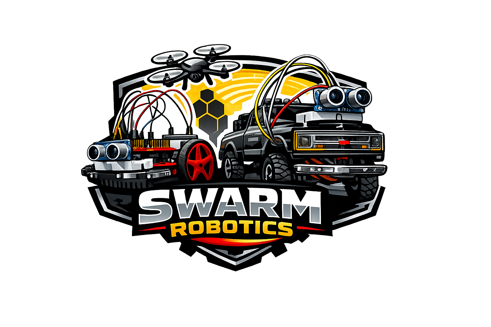

---

## Project Overview

Swarm robotics is a system in which multiple simple robots collaborate to achieve a common goal without a central controller. Each robot responds to its peers and to the environment using local decision-making rules. This concept is inspired by natural systems such as bees and ants, where complex group behavior emerges from simple individual actions.

The goal of this project is to recreate swarm robotics behavior using the Tiva C Series TM4C123G and MSP432 microcontrollers for sensor readings and motor control. A wireless communication network is implemented using the ESP32 microcontroller.

### Swarm Robotics Main Characteristics

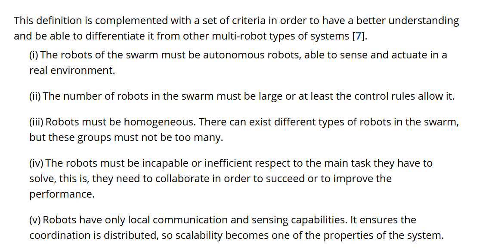

---

## Block diagram of components

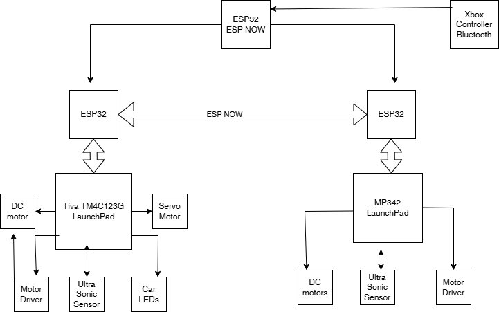

---

## System Architecture

### Overview

The proposed system architecture is divided into three main layers: **control**, **communication**, and **peripherals**. The Tiva C Series TM4C123G and MSP432 microcontrollers are used for low-level control tasks such as reading sensors, driving motors, and handling peripheral operations. The ESP32 is used as the communication layer because it provides built-in wireless capability that is useful for coordination between robots in the swarm. In addition, an Xbox controller is integrated through Bluetooth to provide instant manual override capability for both robots.

One important design choice was to separate real-time control from wireless communication. Each robot uses two microcontrollers: a Tiva or MSP432 for hardware-related tasks, and an ESP32 for communication. If the communication layer fails or is interrupted, the local microcontroller can still manage basic robot behavior.

The architecture is also inspired by insect swarm behavior, where simple agents rely on local rules and limited communication to produce coordinated group actions. In this system, robots begin in manual mode, where commands from the Xbox controller are sent to an ESP32 initiator and then broadcast to selected robots. The user may control one robot individually or multiple robots simultaneously based on the selected robot ID. If the controller signal is lost, the robots transition into autonomous mode.

During autonomous operation, each robot runs a finite state machine and interacts with its environment to determine its current behavior. State information may be shared among peers using ESP-NOW to support swarm coordination. Obstacle detection is currently based on an ultrasonic sensor. Because only one main peripheral sensor is available at this stage, the navigation logic is designed so that the robot reverses when an obstacle is detected, then checks left and right before selecting a new direction. This allows the robot to continue moving through the environment while avoiding obstacles. Manual override remains an essential part of the architecture, allowing the user to retake control at any time.

---

## Interfaces and Peripherals

### Robot 1

Robot 1 is based on a repurposed RC crawler chassis and uses the Tiva microcontroller as its main controller. Several original RC crawler components, including the servo motor, DC motor, LED lights, and 7.4V LiPo battery, were reused in the final design. To drive the DC motor, a single H-bridge motor driver was integrated and controlled through two PWM signals.

Power distribution was designed so that the main battery source is split using a Y-connector, allowing the motor driver to operate from the original 7.4V supply. Additional 3.3V and 5V buck converters were used to provide regulated power to the control electronics and peripherals. The Tiva microcontroller is powered from the 3.3V rail, while the ESP32 is powered from the 5V rail. The ultrasonic sensor is connected through the Tiva’s VBUS supply, and a perfboard was used to build a compact power distribution network for the system. The Tiva uses UART to interface with the ESP32, which handles ESP-NOW communication.

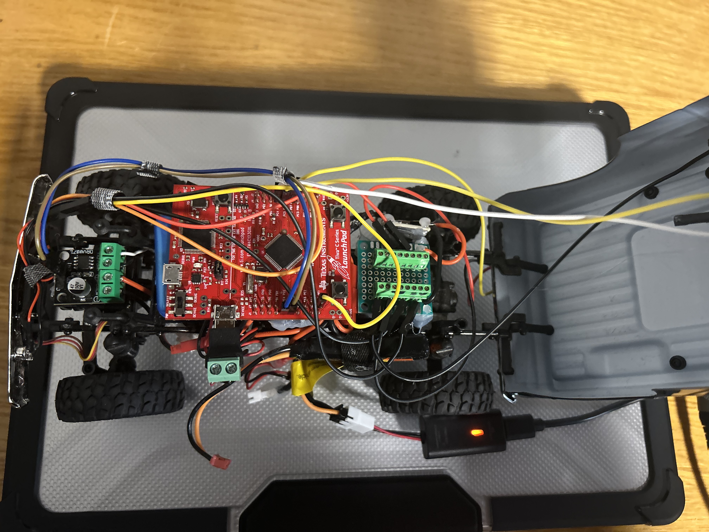

*Figure 1. Robot 1 hardware layout.*

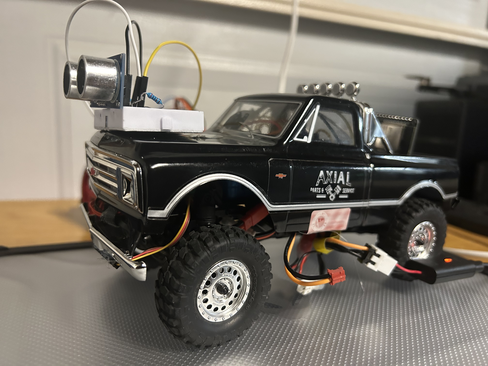

*Figure 2. Robot 1 chassis and embedded system layout.*

**RC crawler chassis reference:** [Axial SCX24 1967 Chevrolet C10 4WD Truck RTR](https://www.axialadventure.com/product/1-24-scx24-1967-chevrolet-c10-4wd-truck-rtr/AXI00001V2.html)

#### Tiva C Series TM4C123G Pin Mapping

| MCU Peripheral | Component | Pins |
|---|---|---|
| UART | ESP32 | PC7 (Tx), PC6 (Rx) |
| GPIO | Ultrasonic Sensor | PC4 (Trigger), PC5 (Echo) |
| GPIO | LEDs | PF1 |
| PWM | Motor Driver | PE4, PE5 |
| PWM | Servo Motor | PB6 |

*Table 1. Tiva C Series TM4C123G peripheral and pin assignments for Robot 1.*

#### Robot 1 Component References

- [7.4V 350mAh 2S LiPo Battery](https://www.axialadventure.com/product/7.4v-350mah-2s-lipo-battery-scx24-ph-2.0/SPMX3502S30.html)
- [AS-1 Micro Servo](https://www.axialadventure.com/product/as-1-micro-servo/AXI31619.html)
- [88T Brushed Motor](https://www.axialadventure.com/product/88t-brushed-motor-11t-10t-pinion-scx24/DYNS1217.html)
- [DRV8871 H-Bridge Motor Driver](https://www.amazon.com/DRV8871-H-Bridge-Control-Circuit-upports/dp/B0G4C4KKTB)

### Robot 2

Robot 2 is built on the TI-RSLK MAX chassis and uses the MSP432 microcontroller for control. The robot is equipped with DC motors for movement and an ultrasonic sensor for obstacle detection. It uses UART to interface with the ESP32, which handles ESP-NOW communication.

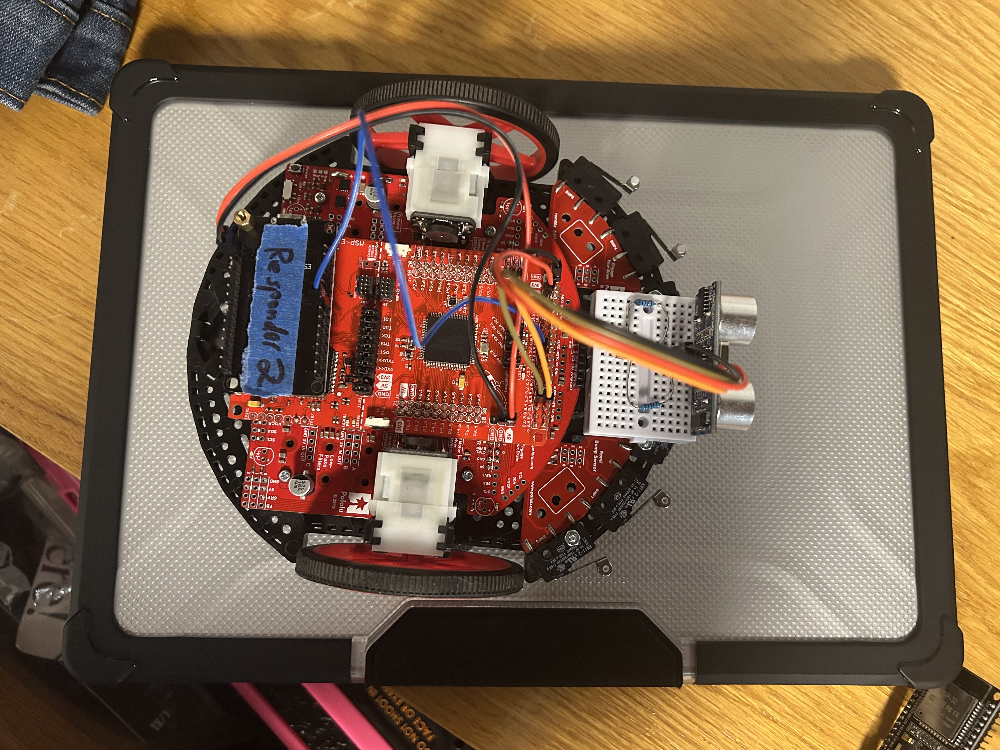

*Figure 3. Robot 2 hardware layout.*

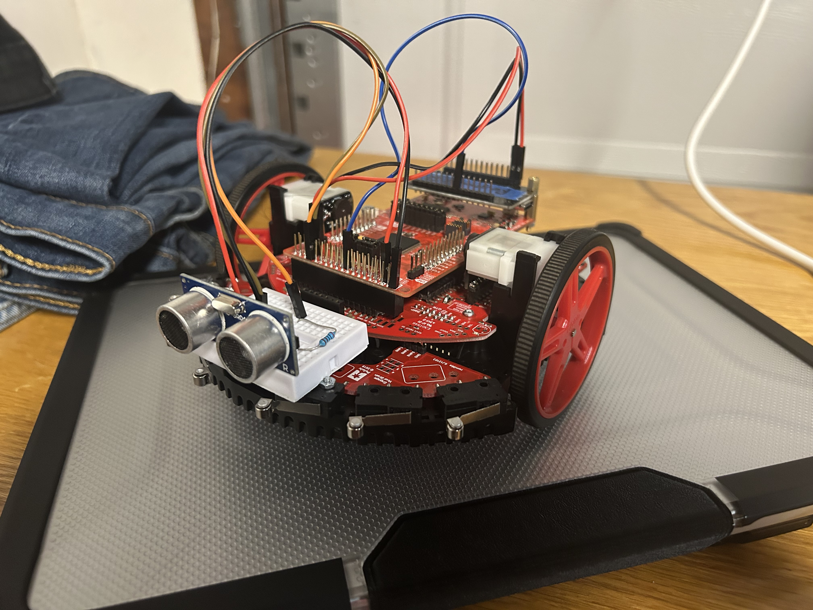

*Figure 4. Robot 2 chassis and embedded system layout.*

#### MSP432 Pin Mapping

| MCU Peripheral | Component | Pins |
|---|---|---|
| UART | ESP32 | P9.6 (Rx), P9.7 (Tx) |
| GPIO | Ultrasonic Sensor | P8.2 (Trigger), P8.3 (Echo) |
| PWM | DC Motors | P2.6 (PM_TA0.3), P2.7 (PM_TA0.4) |

*Table 2. MSP432 peripheral and pin assignments for Robot 2.*

### ESP32 Communication Layer

ESP-NOW is a wireless communication protocol developed by Espressif that allows direct communication between ESP devices without requiring traditional Wi-Fi configuration.

ESP-NOW can be configured in either unidirectional or bidirectional modes. In this project, the Xbox controller is connected to an ESP32 that acts as an ESP-NOW initiator, while the ESP32 microcontrollers on the robots act as responders. The robots can also use bidirectional communication with their peers when needed.

#### Communication Modes

- **One-way communication**
  - Initiator -> responder
  - One initiator -> multiple responders
  - One responder -> multiple initiators

- **Two-way communication**
  - Each device can act as both a responder and an initiator

#### ESP32 Pin Mapping

| MCU Peripheral | Component | Pins |
|---|---|---|
| UART | ESP32 | 17 (Tx), 16 (Rx) |
| ESP-NOW | ESP32 | Wireless |
| Bluetooth | ESP32 | Wireless |

*Table 3. ESP32 peripheral and communication assignments used in the swarm robotics system.*

#### ESP32 Component Reference

- [ESP-WROOM-32 Development Board](https://www.amazon.com/Hosyond-ESP-WROOM-32-Development-Microcontroller-Compatible/dp/B0C7C2HQ7P)

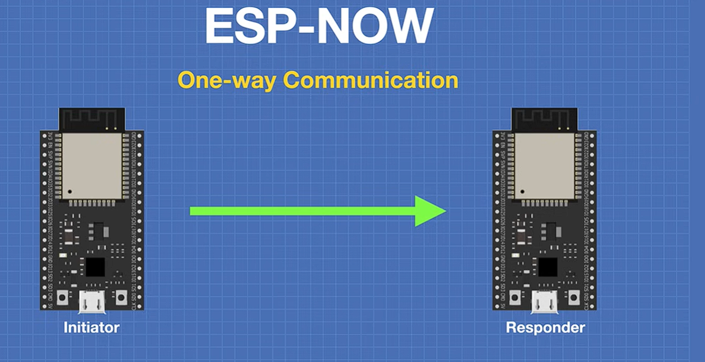

*Figure 5. ESP-NOW initiator and responder setup.*

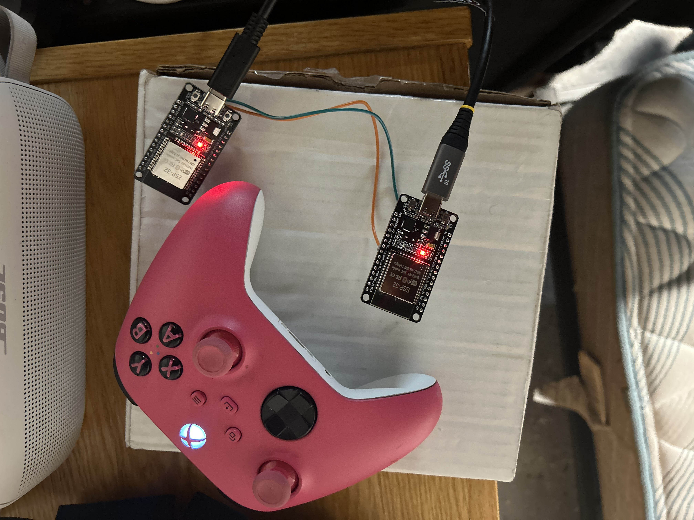

*Figure 6. ESP32 communication hardware.*

---

## Verification and Testing

### Sensor Readings and Motor Control

#### Robot 2 Manual-to-Autonomous Transition

Robot 2 uses the MSP432 and transitions from manual input to the autonomous state machine after no UART input is detected for a defined period.

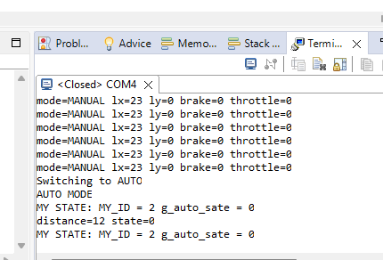

*Figure 7. Robot 2 switching from manual mode to autonomous mode.*

#### Robot 1 Autonomous-to-Manual Transition

Robot 1 uses the Tiva and transitions from the autonomous state machine back to manual controller input when UART data is detected. This example shows the issue encountered when switching from autonomous mode back to manual mode.

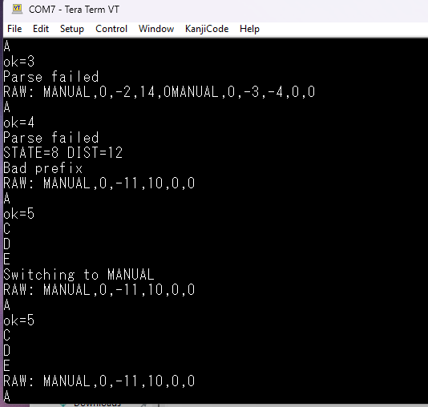

*Figure 8. Robot 1 switching from autonomous mode back to manual mode.*

### Wireless Communication Verification

The following figure shows the ESP-NOW initiator sending commands while the ESP-NOW responders receive and process those commands.

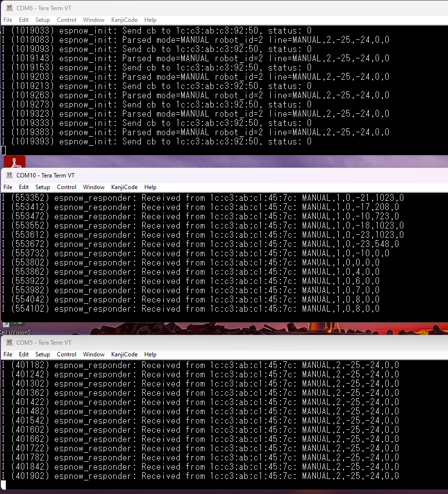

*Figure 9. ESP-NOW network verification.*

---

## Conclusion

This project demonstrated the potential for implementing swarm robotics using the ESP32’s built-in wireless communication together with Tiva and MSP432 microcontrollers. The project successfully achieved the transition from manual to autonomous operation, although the transition from autonomous back to manual control still requires further refinement. Future work will focus on improving transition reliability and expanding the swarm capabilities of the robots. This may be improved by using timer interrupts to detect the presence or loss of the control signal, rather than relying solely on polling methods.

The project also provided valuable experience in embedded systems design, hardware-level programming, finite state machine implementation, and wireless communication. In addition, it highlighted the importance of debugging and iterative design in building reliable embedded systems. Overall, the work serves as a strong example of how simple swarm robotics behavior can be developed using decentralized control. With the addition of more advanced sensors, such as localization and environmental sensing, the robots could make more intelligent decisions based on both peer interactions and environmental conditions, leading to more advanced and natural swarm behavior.

---

## Video Links

- [ESP-NOW Wireless Communication](https://youtu.be/asMD70wlka4)
- [Manual Mode](https://youtu.be/8eCgVpozRfA)
- [Autonomous Mode](https://youtu.be/_uCekhfg5BQ)

## Works Cited

- [Swarm Robotics Reviewed](https://onlinelibrary.wiley.com/doi/full/10.5402/2013/608164)
- [ESP-NOW | Espressif](https://www.espressif.com/en/solutions/low-power-solutions/esp-now)
- [Swarm Search and Rescue Drones](https://www.mdpi.com/2504-446X/7/4/269)
- [ESP NOW Tutorial video](https://www.youtube.com/watch?v=bEKjCDDUPaU&t=1s)
- [SparkFun HC-SR04 Example Code](https://github.com/sparkfun/HC-SR04_UltrasonicSensor/blob/master/Firmware/HC-SR04_UltrasonicSensorExample/HC-SR04_UltrasonicSensorExample.ino)
- [HC-SR04 Datasheet](https://cdn.sparkfun.com/datasheets/Sensors/Proximity/HCSR04.pdf)
- [ESP-IDF ESP-NOW Example](https://github.com/espressif/esp-idf/tree/c0087486/examples/wifi/espnow)
- [Bluepad32 GitHub Repository](https://github.com/ricardoquesada/bluepad32)
- [Axial SCX24 1967 Chevrolet C10 4WD Truck RTR](https://www.axialadventure.com/product/1-24-scx24-1967-chevrolet-c10-4wd-truck-rtr/AXI00001V2.html)

## Project GitHub Repository

- [Swarm-Robotics-Behavior](https://github.com/zaragoza-ricardo/ECE-528-Swarm-Robotics-Behavior)